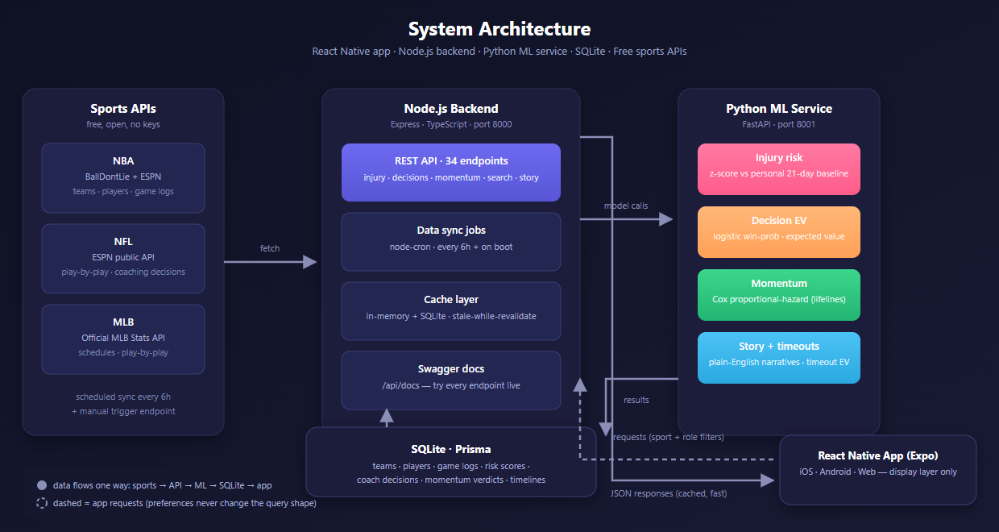
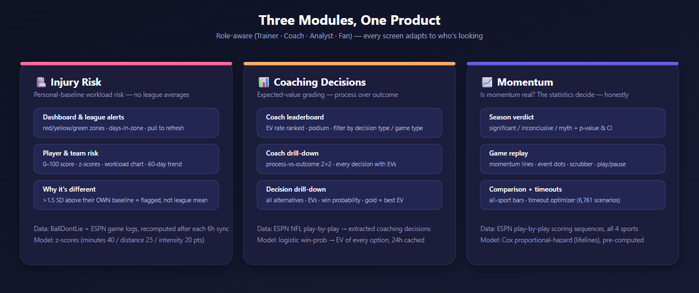
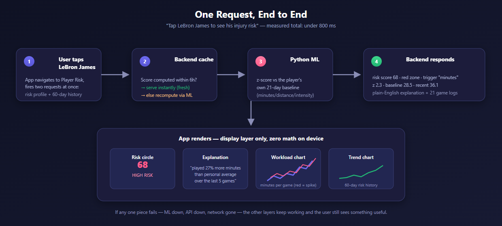

<div align="center">

# APEX - AQX Sports Intelligence

**Injury risk · Coaching decisions · Momentum — powered by real sports data and statistical models**

React Native app · Node.js backend · Python ML service · SQLite · Free sports APIs

[Architecture](#architecture) · [Modules](#the-three-modules) · [Getting Started](#getting-started) · [API](#api) · [Demo Guide](#demo-guide) · [Testing](#testing) · [Docs](#documentation)

</div>

---

## What this is

AQX Sports Intelligence is a full-stack sports analytics platform that turns raw game data into **plain-English answers** for three questions teams, coaches and fans actually ask:

| Module | Question it answers |
|---|---|
| 🏥 **Injury Risk** | *Is this player at risk?* — compared to their **own** 21-day baseline, not the league average |
| 📊 **Coaching Decisions** | *Did the coach make the right call?* — expected value of every option, graded on process, not outcome |
| 📈 **Momentum** | *Is momentum actually real?* — a Cox proportional-hazard model that shows its p-values instead of assuming |

Every screen is **role-aware** (Trainer, Coach, Analyst, Fan) and **sport-aware** (NBA, NFL, MLB, NHL) — preferences live on the device and shape what's displayed, never what's computed.



## The three modules



### 🏥 Injury Risk
Player risk scores (0–100) with red / yellow / green zones, built from a **personal baseline** — each player's own mean and standard deviation over the last 21 days. If their recent workload (last ~7 games) spikes more than **1.5 standard deviations above their own norm**, they're flagged. League-wide alerts, team risk, workload charts, 60-day trends, and "how long in the red zone" are all computed backend-side.

### 📊 Coaching Decisions
Every coaching decision extracted from play-by-play is graded by **expected value**: `EV = P(success) × WP(success) + P(fail) × WP(fail)`, where win probability comes from a logistic regression model. Coaches are ranked by EV rate on a leaderboard, and the coach detail screen shows a **process-vs-outcome 2×2 matrix** — a bad outcome from a good process is still graded good.

### 📈 Momentum
A Cox proportional-hazard model (lifelines) fits each sport's scoring sequences: after a team scores N straight points, does the opponent's hazard of scoring next change? The honest answers right now: **NHL significant (p = 0.001), NBA inconclusive (p ≈ 0.09), NFL & MLB not significant.** The game replay screen shows per-game momentum timelines with a scrubber, and the timeout optimizer answers "should they call timeout?" from 6,761 pre-computed scenarios.

## How a request flows



Data flows one way — **sports world → APIs → Node backend → Python ML → SQLite → cached responses → app**. The app is a display layer: it can't compute anything and doesn't try. If any one piece goes down, the others keep working and the user still sees something useful.

## Architecture

| Layer | Stack |
|---|---|
| **App** | React Native (Expo) · TypeScript · react-native-web — runs on iOS, Android & web |
| **Backend** | Node.js · Express 5 · TypeScript (strict, ESM) · port `8000` |
| **ML service** | Python · FastAPI · scikit-learn · lifelines · port `8001` |
| **Database** | SQLite via better-sqlite3 + Prisma (multi-file schema) |
| **Caching** | In-memory (node-cache) + SQLite registry — survives restarts, stale-while-revalidate, `X-Cache-Status` headers |
| **Data sources** | BallDontLie (NBA) · ESPN public API (NFL + play-by-play) · MLB Stats API — all free, no keys |
| **API docs** | Swagger UI auto-generated from JSDoc — `/api/docs` |

**Measured performance** (real browser + live services): app cold start → Home with data **≈1.7s**, warm open **≈0.5s**; leaderboard **2–9ms**, player risk **4–9ms**, game replay **4–16ms** (pre-computed). See [Testing](#testing) for how to reproduce.

## Quick Start

### Prerequisites

- **Node.js** ≥ 20
- **Python** 3.11+
- **Docker** (optional)

### Option 1: Docker (Recommended)

```bash
docker compose up --build
```

| Service | URL |
|:---|:---|
| App | http://localhost:8081 |
| Backend API / Swagger | http://localhost:8000/api/docs |
| ML Health | http://localhost:8001/health |

### Option 2: Manual Setup

**Backend + ML Service:**

```bash
cd backend
npm install
cp .env.example .env
npm run db:push
npm run db:seed:demo

# Terminal 2: ML Service
cd python_ml
pip install -r requirements.txt
uvicorn app.main:app --host 0.0.0.0 --port 8001

# Terminal 1: Backend
npm run dev
```

**App:**

```bash
cd apex
npm install
npx expo start  # press "w" for web
```

### Option 3: Make Commands

```bash
make up          # Docker: full stack
make dev         # No Docker: 3 terminals
make backend     # Backend only
make ml          # ML service only
make app         # App only
```

### Demo Credentials

- **Email**: `demo@apex.app`
- **Password**: `apex1234`

> **Tip:** Use the demo account to explore the app. The dashboard loads with pre-loaded NBA data — 30 teams, 450 players, injury risk scores, coaching decisions, and momentum analysis. Switch between roles (Trainer, Coach, Analyst, Fan) in Settings to see how the interface adapts.

## API

- **Swagger UI:** <http://localhost:8000/api/docs> (also `/api-docs`)
- **Raw OpenAPI spec:** <http://localhost:8000/api-docs.json>
- **Health:** <http://localhost:8000/api/health>

All **34 endpoints** have live "Try it out" support and realistic example responses. Highlights:

| Area | Endpoints |
|---|---|
| Injury | player risk · team risk · league alerts · risk history · zone counts |
| Decisions | coach leaderboard · coach drill-down · game decisions · decision types |
| Momentum | season analysis · game timeline · sport comparison · timeout optimizer |
| Search | players · teams · coaches · games |
| System | health · cache stats/invalidate · jobs trigger/status · story mode · sync · logs |

Every response follows one envelope: `{ success, status, data, message, timestamp }`, and every request/response pair is documented in Swagger.

## Demo guide

For hackathon judging — a 2-minute script, honest answers to judge questions, and what to say about the data (it's a pre-loaded snapshot, not a live sync):

📄 **[`docs/demo-judge-qa.md`](docs/demo-judge-qa.md)**

Quick facts:
- **Login:** "Use demo account" — email `demo@apex.app`, password `apex1234`
- **Roles:** Trainer / Coach / Analyst / Fan — changes what's displayed, never what's requested
- **Story mode:** available on Home and module screens — generates a plain-English narrative from the current data
- **Refresh:** pull-to-refresh on every list screen; the dashboard's refresh forces a backend recalculate
- **Freshness:** every response carries a timestamp; the app shows "updated X hours ago" and warns when data is old

## Testing

The project ships a full verification suite (each file is self-contained and documented):

```bash
# Backend — 36 API checks across every demo screen
cd backend && node scripts/validate-demo-data.mjs

# Backend — TypeScript strict
npm run typecheck

# App — end-to-end in headless Chrome (onboarding → tabs → search →
# story mode → role change), backend + expo web must be running
cd apex && node scripts/e2e-level7.mjs

# App — cold/warm load-time measurement (backend + expo web must be running)
cd apex && node scripts/perf-load.mjs
```

Perf results and the step-by-step test plan for backend, data fetching, ML models, caching, error handling and the app live in the [testing docs](docs/test_e2e.md).

## Documentation

| Doc | What it covers |
|---|---|
| [`docs/backend_overview.md`](docs/backend_overview.md) | Backend design, phases, contracts |
| [`docs/database_schema.md`](docs/database_schema.md) | Every table and relation |
| [`docs/app_overview.md`](docs/app_overview.md) | App architecture and screens |
| [`docs/apex_integration_plan.md`](docs/apex_integration_plan.md) | End-to-end integration plan |
| [`docs/demo-judge-qa.md`](docs/demo-judge-qa.md) | Judge Q&A cheat sheet |
| [`backend/README.md`](backend/README.md) | Backend setup, scripts, layout |
| [`apex/README.md`](apex/README.md) | App setup and structure |

## CI / CD

GitHub Actions pipelines run automatically on push and pull requests. The app, backend and ML service each have their own workflow; a release workflow packages everything (including the trained models and the Android APK) into a **GitHub Release**.

| Workflow | Runs on | What it does |
|---|---|---|
| [`backend.yml`](.github/workflows/backend.yml) | push/PR touching `backend/**` | npm ci, ESLint, typecheck, build, `prisma validate` |
| [`ml.yml`](.github/workflows/ml.yml) | push/PR touching `backend/python_ml/**` | pip install, pytest, model warmup smoke test |
| [`app.yml`](.github/workflows/app.yml) | push/PR touching `apex/**` | npm ci, expo lint, typecheck, web bundle export |
| [`apk.yml`](.github/workflows/apk.yml) | manual dispatch, or called by Release | `expo prebuild` + Gradle `assembleRelease` → installable APK |
| [`release.yml`](.github/workflows/release.yml) | tag `v*` or manual dispatch | builds backend + ML (with trained models) + APK, publishes a GitHub Release |

**Trigger an APK build:** Actions → **Android APK** → *Run workflow*.

**Create a release:** push a tag (`git tag v1.0.0 && git push origin v1.0.0`) — or Actions → **Release** → *Run workflow* with a version. The release attaches:

- `apex-backend-<tag>.tar.gz` — compiled `dist/` + Prisma schema + package files (run with `npm ci --omit=dev && npm run db:generate && npm start`)
- `apex-ml-<tag>.tar.gz` — the FastAPI service **with pre-trained models** (run with `pip install -r requirements.txt && uvicorn app.main:app --port 8001`)
- `app-release.apk` — installable Android build (signed with the debug keystore)


## License

[MIT](LICENSE) © 2026 AQX
